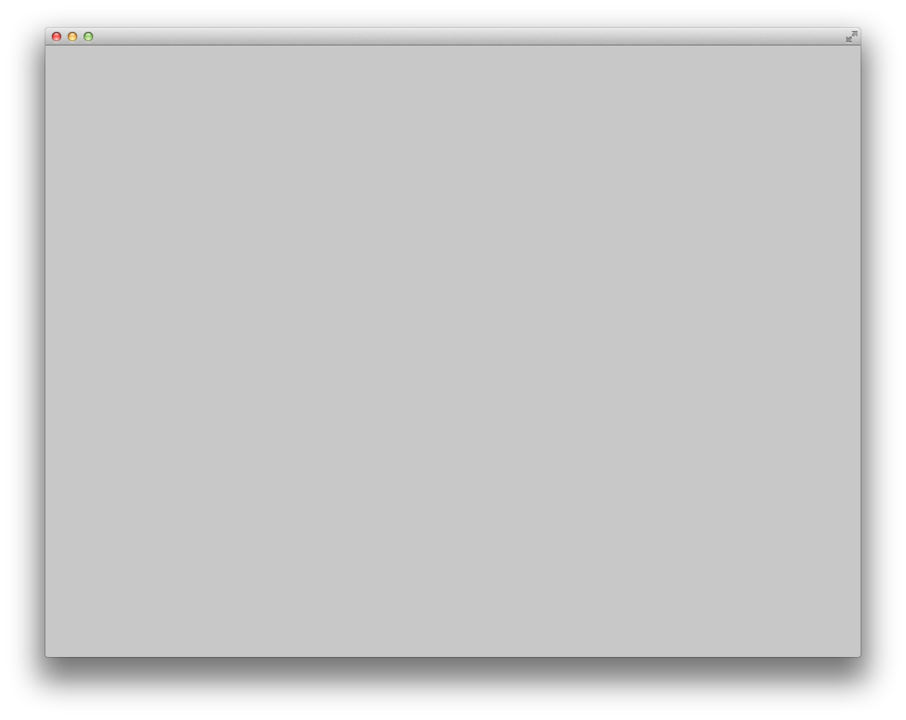

# Visibility Algorithm

The objective is the calculate the visible region (blue area) from a point Q (red dot) on a 2d plane having a set of non intersecting line segments (green line segments). 

## Our Output Video 

https://github.com/nishita96/VisibilityAlgorithm/assets/24264347/a9db5e29-fac3-4c8e-8475-f5d186ae7d48

individual line segment processing 

Pair of line segments 

pairwise merging 

Resultant area of visibility 

## Our test data 

## On CPU

serially merging 

## On GPU 

parallely merging 

## Performance Comparison
Sequential CPU implementation vs reduction sum GPU implementation 

## Setup for CPU

- Install [https://openframeworks.cc/download/](#Openframeworks) 
- CPP development environment 
- Make project in it with the cloned repo

## Setup for GPU

- Install [CUDA](https://docs.nvidia.com/cuda/)
- CPP development environment 
- Clone the repo
- Build using make and Run

## Future Scope 
- The GPU result can also be incorporated to display the result using OpenFrameworks.
- It can process intersecting line and split them into 2 line segments each to process using the same algorithm. 

#### Reference paper

<!-- 

### Learning Objectives -->

[comment]: <> (This example is the simplest possible openFrameworks app! It does nothing. )

<!-- ...Well, *almost* nothing. Although it may not be apparent, the emptyExample activates all of the default system states. (For example, it sets the default fill color to white; it just doesn't happen to draw anything with it.)

The emptyExample is great for making sure that your openFrameworks development environment is compiling properly. It can also be useful as a "starter template" for making simple programs. 

The emptyExample will help you understand what are the bare necessities of an openFrameworks program. In this regard, you can think of it as a "Hello World" for OF.  -->

<!-- ### Expected Behavior

When launching this app, you should see a light-gray screen. 

* There's no interaction. 
* There's nothing to see. 
* That's it.  -->

